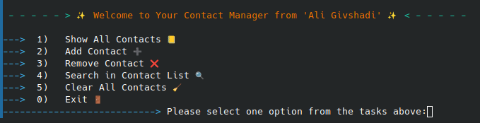

A simple terminal-based Contact Manager written in Python that allows users to store, search, update, and manage contacts easily.
---
## 📸 Screenshot

---
## ✨ Features
✔ Add new contacts  
✔ List all saved contacts  
✔ Search contacts by name  
✔ Update contact information  
✔ Delete contacts  
✔ Auto-save data to local storage  
---
## 📂 Project Structure
contact-manager
├── main.py
├── data_structure.py
├── Screenshot_20251122_134328.png
└── README.md
---

## 🚀 How to Run
```bash
# 1️⃣ Clone the project
git clone https://github.com/aligivshadi/Contact-Manager.git
```
```bash
# 2️⃣ Enter the folder
cd Contact-Manager
```
python3 main.py
```bash
# 3️⃣ Run the app
python3 main.py
```
🧠 Technologies Used
Python 3
File-based local storage
Simple command-line UI

🛠 Future Improvements (TODO)
Add colored UI
Add phone number validation
Support exporting contacts to CSV
Build GUI version (Tkinter or PyQt)
Build Telegram Bot version

📜 License
This project is licensed under the MIT License
